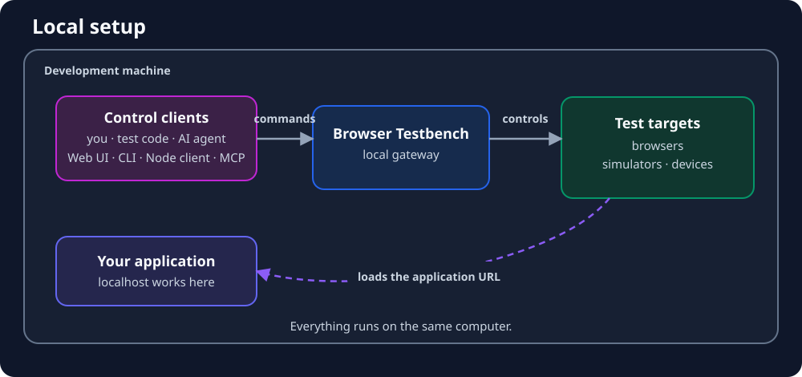
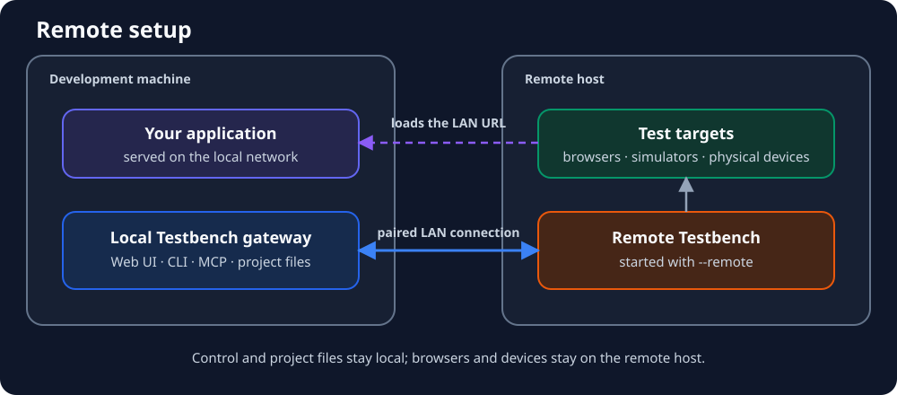

# Browser Testbench

A local, project-independent remote control for real desktop browsers, iOS simulators, physical iPhones and iPads,
Android emulators, and physical Android devices.

The responsibilities are deliberately clear:

- Browser Testbench detects, launches, and controls browsers and simulated devices.
- Your project starts its own development server and owns its test flows, URLs, assertions, and result files.
- AI assistants access the same controls through MCP.

Browser Testbench does not import test files from a project or run third-party test runners.

Release documentation: [Browser Testbench 0.5.0](docs/releases/0.5.0.md) and [migration from 0.4.x](docs/releases/0.5.0-migration.md).

## Supported targets

| Target                                | macOS | Windows | Linux |
| ------------------------------------- | ----- | ------- | ----- |
| Chrome                                | yes   | yes     | yes   |
| Firefox                               | yes   | yes     | yes   |
| Safari                                | yes   | –       | –     |
| Edge                                  | yes   | yes     | yes   |
| Safari on iOS Simulator or USB device | yes   | –       | –     |
| Chrome on Android (USB or emulator)   | yes   | yes     | yes   |

Mobile sessions are controlled through Appium with XCUITest or UiAutomator2. The web interface detects installed browsers, physical devices, simulators, emulators, and required setup steps.

### Physical Android devices

1. Install Android Studio or the Android SDK Platform Tools on the Testbench computer.
2. Enable Developer options on the device by tapping its build number seven times.
3. Enable USB debugging under Developer options.
4. Connect and unlock the device, then accept the USB debugging authorization prompt.
5. Install or enable Google Chrome on the device.
6. Confirm that the device is ready on the Browser Testbench Overview page.
7. Run its generated target once from the Test targets page.

Browser Testbench detects every authorized device through ADB and creates a separate, stable test target for it.
Connecting, disconnecting, or changing the authorization state updates the open web interface automatically. Local URLs
such as `http://127.0.0.1:3000` are forwarded over USB for the duration of the session and require no Wi-Fi configuration.

For Android emulator testing, setup reuses an existing compatible Google Play AVD. If none exists and no physical device is connected, it selects the newest matching Google Play system image already installed for the host architecture and the newest available generic Pixel hardware profile. The generated AVD name contains both values, for example `browser-testbench-pixel-10-api-37-1`. Only when no suitable image is installed does the setup ask you to install the latest one through Android Studio's SDK Manager; no API level or Pixel model is hard-coded.

### Physical iPhones and iPads

Safari on a physical iPhone or iPad requires a macOS host with Xcode, a USB connection, and an Apple Account signed
in to Xcode. Both a free Personal Team and a paid Apple Developer team are supported. Paid teams can use automatic
WebDriverAgent provisioning. A free Personal Team requires the guided WebDriverAgent signing step in Xcode, and its
provisioning profile expires after seven days; Browser Testbench reports signing failures with the exact recovery
steps, but Apple requires the profile to be rebuilt periodically.

The Overview page detects recently connected devices and guides the required steps without asking Browser Testbench
for Apple credentials:

1. Connect and unlock the device, then accept **Trust This Computer**.
2. Add the free or paid Apple Account under Xcode's Accounts settings.
3. Enable **Developer Mode** under **Settings → Privacy & Security**, restart, and confirm it after restart.
4. Open **Window → Devices and Simulators** in Xcode, select the device, and wait until Xcode shows it as available
   without a warning or a **Preparing** status.
5. Enable **UI Automation** under **Settings → Developer**.
6. Enable **Web Inspector** and **Remote Automation** under **Settings → Apps → Safari → Advanced**.
7. Install the Appium XCUITest driver from the Overview page and run the generated physical-device target once.

To prepare WebDriverAgent signing:

1. Run the WebDriverAgent command shown for the iPhone on the Overview page; it opens `WebDriverAgent.xcodeproj`.
2. In **Xcode → Settings → Accounts**, add the Apple Account, select its team, open **Manage Certificates**, and create
   an **Apple Development** certificate if none exists.
3. On the Overview page, select **Check again**, expand Safari on iOS, and copy the exact WebDriverAgent bundle ID now
   shown for the device.
4. A paid Developer team can first run the physical target and let Xcode provision it automatically.
5. For a free Personal Team or failed automatic provisioning, select **WebDriverAgentRunner → Signing & Capabilities**
   in Xcode, enable automatic signing, select the team, and enter the bundle ID shown by Browser Testbench.
6. Select **Product → Scheme → WebDriverAgentRunner**, select the iPhone under **Product → Destination**, and run
   **Product → Test**. If iOS reports an untrusted developer, trust the account under
   **Settings → General → VPN & Device Management**.
7. Run the physical target again. Free profiles expire after seven days; repeat the Xcode **Product → Test** step after
   expiry or when an XCUITest update replaces WebDriverAgent.

If Xcode reports **Logic Testing Unavailable** after a successful WebDriverAgent build on a physical iOS 16 device,
the signing setup is complete but the selected Xcode version is incompatible. Xcode 26.4 and 26.6 are known to exhibit
this regression with iOS 16. Download Xcode 26.2 from Apple's
[More Downloads](https://developer.apple.com/download/all/?q=Xcode%2026.2) page, install it as
`/Applications/Xcode-26.2.app`, select it with
`sudo xcode-select --switch /Applications/Xcode-26.2.app/Contents/Developer`, verify `xcodebuild -version`, and install
the iOS 26.2 platform component under **Xcode → Settings → Components** if Xcode offers it. Wait for the installation to
finish, then run the physical target again. Recreating the certificate or provisioning profile does not resolve this
failure.

If the certificate is listed but is not detected, open **Keychain Access → login → My Certificates** and expand it. A
private key must appear below the certificate. If it does and the identity is still rejected, install Apple's official
[Worldwide Developer Relations G3 intermediate certificate](https://www.apple.com/certificateauthority/AppleWWDRCAG3.cer)
in the login keychain and keep its trust setting at **Use System Defaults**.

When more than one signing team is installed, start Browser Testbench with `BROWSER_TESTBENCH_IOS_TEAM_ID` set to the
intended ten-character team ID.

USB carries device control, but iOS does not provide Browser Testbench with Android-style reverse port forwarding.
The iPhone or iPad must be able to reach the computer that actually runs the tested application. Bind that application
to a LAN interface and use its host's explicit LAN address or hostname rather than `localhost`. This may be the local
development computer, the Testbench host, or another machine. Browser Testbench rejects unreachable loopback URLs before
starting the device session.

## Installation and startup

Node.js 22.12 or 24 and newer is required. Install Browser Testbench globally once on each machine:

```bash
npm install --global browser-testbench
browser-testbench start
```

Video recording and exact mobile viewport screenshots also require `ffmpeg` and `ffprobe` on `PATH`. They are not bundled with the npm package. The Overview page detects them and shows the installation command for macOS, Windows, or Linux. Existing WebDriver screenshots and structured desktop, element, and mobile screen screenshots remain available without these tools.

By default, the interface runs at `http://127.0.0.1:55808/setup` and opens on startup. To use a different address:

```bash
browser-testbench start --port 7788 --no-open
```

The web interface has three sections:

- `/setup`: inspect and set up the environment
- `/targets`: verify test targets and generate project commands
- `/docs`: local documentation and examples

The interface and its embedded documentation use the browser language when English or German is requested. English is
the default and fallback for every other language.

The project license and third-party license notices are included as `LICENSE.txt` and `THIRD_PARTY_LICENSES.txt` and linked from the interface footer.

A bearer token is required when binding a normal, non-discoverable server to an address other than loopback:

```bash
browser-testbench start --host 0.0.0.0 --token "$BROWSER_TESTBENCH_TOKEN"
```

Browser Testbench serves plain HTTP. A bearer token authenticates requests but does not encrypt the token or test
traffic. Use a non-loopback binding only on a trusted private network. For any other network, keep Browser Testbench
on loopback and expose it only through a TLS-terminating reverse proxy. Configure the proxy's upstream `Host` header
as `127.0.0.1` or `localhost`; foreign host headers are rejected by the loopback service. Never expose the HTTP
service directly to the public internet.

## Setup examples

### Local setup



The application, Browser Testbench, and all test targets run on the same computer. Loopback URLs such as
`http://127.0.0.1:5173` work because the browser and application share the same network context. A physical iPhone or
iPad is the exception and requires a reachable LAN address of the computer running the application, as described above.

### Remote setup



The UI, CLI, MCP server, and project files stay on the development machine. A paired remote Testbench controls
the browsers and devices on another computer. The application must be reachable from that host through the local
network.

## Remote Testbench

A local Testbench can use the browsers and physical devices of another computer while the UI, CLI, Node client,
and MCP server stay on the development machine. The two computers may run macOS, Windows, or Linux. The local
server always starts in local mode; a saved pairing is never activated automatically.

Project clients, local gateways, and remote hosts must run the exact same Browser Testbench version. Incompatible
versions are rejected with update guidance instead of attempting a potentially incompatible connection.

### Start the remote host

Install the same published Browser Testbench version on the remote host and start it explicitly in remote mode:

```bash
npm install --global browser-testbench
browser-testbench start --remote
```

When developing from a repository checkout instead, update the checkout and run:

```bash
git pull --ff-only
npm ci
npm run dev -- start --remote
```

`--remote` binds to all network interfaces, advertises the service through DNS-SD/mDNS, and requires an
individually paired client credential. Use it only on a trusted private LAN. No bearer token or knowledge of the
host's IP address grants remote access. Pairing authenticates control requests but does not encrypt HTTP traffic,
including test input, diagnostics, screenshots, and artifacts. A headless host can run the same command with `--no-open` under the
operating system's normal service or process manager.

### Connect the development machine

Start the normal local gateway on the computer from which you want to control the Testbench:

```bash
browser-testbench start
```

For a repository checkout, use `npm run dev -- start` instead. Open `http://127.0.0.1:55808/setup`, expand
**Connect to a central Testbench**, choose **Discover**, and connect to the remote host. The first attempt creates a
six-digit, five-minute pairing code shown in the remote host's terminal and local Testbench UI. Enter it on the
development machine. Later explicit connections reuse the saved per-client credential without another code.
Select “administrative access” only when remote setup and paired-client administration are needed.

The same flow is available without the UI:

```bash
browser-testbench discover
browser-testbench connect <name-or-instance-id>
browser-testbench status
browser-testbench disconnect
```

If multicast discovery is blocked by a firewall, VPN, or subnet boundary, use
`browser-testbench connect --server http://REMOTE-HOST:55808`. Pairing credentials are stored in the
platform-specific Browser Testbench user-data directory, never in the repository. Use `--gateway` only when the
local gateway itself does not run at its default URL.

While connected, the existing pages and commands show remote capabilities and targets. The UI updates connection,
device, target, and setup state automatically. On the remote host, **Paired clients** also shows which clients are
currently connected. A control pairing can run tests, sessions, screenshots, and diagnostics; remote installation
and configuration controls are disabled. An admin pairing additionally permits setup and management of paired
clients. Multiple clients may use different targets concurrently. A serial device displays only `Busy`; requests
wait FIFO for up to 60 seconds by default, or fail immediately with `lockTimeoutMs: 0`.

Remote browsers cannot reach an application on the development machine through a loopback URL such as
`http://127.0.0.1:5173`: on the remote host, that address refers to the remote host itself. Bind the application to
a LAN interface and pass the development machine's LAN URL, for example `http://192.168.1.20:5173`. Browser
Testbench detects loopback URLs before starting a remote session and reports this requirement without rewriting
the URL.

Screenshots, uploads, downloads, PDFs, and mobile video results cross the gateway so project paths remain on the
development machine. Individual transferred files are limited to 50 MiB. Disconnect closes this client's
sessions and queued device requests; a heartbeat and server-side lease clean up a client that disappears
unexpectedly.

### Platform notes

- On Windows, allow Node.js on private networks if Windows Firewall asks.
- On macOS, allow local-network access if the operating system asks. Safari and iOS Simulator targets are
  available only on macOS.
- On Linux, ensure the selected firewall permits the Testbench port and local mDNS traffic when discovery is
  required.

To avoid unexpected macOS permission dialogs, Safari is never launched automatically. Enable its driver once:

```bash
sudo safaridriver --enable
browser-testbench verify safari
```

`verify` accepts any concrete ID returned by `browser-testbench targets` and runs the check through the active Browser Testbench server. You can trigger the same check explicitly from the web interface with “Run test”.

## Two workflows

### Interactive development and debugging

An AI assistant can use MCP to open a session, navigate, inspect elements, click, type, take screenshots, and perform mobile gestures. The MCP process is a lightweight bridge to the running Browser Testbench server; target resolution, sessions, and device locks remain centralized. Console output, HTTP requests and responses, and WebSocket connections and frames are available through `get_diagnostics` on Chromium desktop targets.

The Targets page in the web interface can also open a browser or device directly. Enter the application URL, select a target, and choose **Open browser**. Active debug sessions are listed there until you close them. For local Chromium desktop sessions, the interface provides a direct link to the DevTools instance. The generated `browser-testbench open` command remains available as a terminal alternative.

`get_devtools_instructions` provides the appropriate connection for native browser developer tools:

- iOS Simulator: Safari Web Inspector through Safari's Develop menu.
- Android devices and emulators: Chrome DevTools through `chrome://inspect/#devices`.
- Chromium on desktop: a direct DevTools link when Chrome exposes one, plus console and network diagnostics through Browser Testbench.

### Automated project tests

Browser Testbench creates a stable ID for every detected browser and compatible mobile device. Examples include `chrome`, `safari-ios-iphone-17-pro-26-5`, and `chrome-android-pixel-8-16`. The web interface lists every ID with a copy button. No project configuration file is required.

Install the client in your project:

```bash
npm install --save-dev browser-testbench
```

Any Node-based test runner can then use the same remote control:

```js
import assert from "node:assert/strict";
import { RemoteTestbench } from "browser-testbench/client";

const testbench = new RemoteTestbench();
const targets = await testbench.availableTargets(["chrome", "safari-ios-iphone-17-pro-26-5"]);

for (const target of targets) {
  const browser = await testbench.open({
    target,
    url: "http://127.0.0.1:5173/login",
    headless: true,
  });

  try {
    await browser.fill('input[name="email"]', "test@example.com");
    await browser.check('[data-testid="terms"]');
    await browser.click('button[type="submit"]');
    await browser.waitForText("Welcome");
    assert.match((await browser.inspect()).url, /dashboard/);
    await browser.screenshot(`artifacts/login-${target}.png`);
  } finally {
    await browser.close();
  }
}
```

`availableTargets()` preserves the requested order and skips targets that are not ready on the current machine. If none of the requested targets are ready, the promise rejects. Browser Testbench resolves a mobile ID internally to its `deviceName`, platform version, and UDID or AVD. Mobile targets ignore `headless`.

For parallel execution, use `forEachTarget()`. Different devices can run in parallel; access to the same serial target is queued by the server.

## Node client

`RemoteTestbench` connects to `http://127.0.0.1:55808` by default. Set a different address through
`BROWSER_TESTBENCH_URL` or the constructor. Requests time out after 120 seconds by default; use
`requestTimeoutMs` in the constructor or `timeoutMs` on `request()` to override this, and pass an `AbortSignal` to
cancel an individual request. Mobile session startup and verification allow seven minutes so a cold simulator or
emulator can finish booting. The client provides:

- `targets()`, `capabilities()`, and `availableTargets([...])`
- `open({ target, url, ... })`
- `forEachTarget(targets, options, callback)`

A `RemoteSession` provides:

- Metadata: `id`, `target`, and `runtime`
- Page inspection: `inspect()`, `url()`, `title()`, and `source()`
- Navigation: `navigate()`, `back()`, `forward()`, `refresh()`, and `scroll()`
- Element state and input: `state()`, `count()`, `click()`, `type()`, `press()`, `focus()`, `blur()`, `hover()`,
  `doubleClick()`, `rightClick()`, `drag()`, and `scrollIntoView()`
- Forms and files: `fill()`, `append()`, `clear()`, `check()`, `uncheck()`, `select()`, `upload()`, and `submit()`
- Waiting: `waitForElement()`, `waitForText()`, `waitForUrl()`, `waitForState()`, `waitForValue()`,
  `waitForCount()`, `waitForAttribute()`, `waitForElementText()`, `waitForWindowCount()`, `waitForNetworkIdle()`,
  `waitForScript()`, and the low-level `wait()`
- Windows, frames, and dialogs: `windows()`, `newWindow()`, `switchWindow()`, `closeWindow()`, `switchFrame()`,
  and `alert()`
- Cookies and storage: `cookies()`, `setCookie()`, `deleteCookie()`, `storage()`, `setStorage()`, and
  `deleteStorage()`
- Reusable browser state: `snapshotState()`, `restoreState()`, `saveState()`, and `loadState()`
- Screenshots and documents: `screenshot()`, `screenshotBase64()`, `elementScreenshot()`,
  `elementScreenshotBase64()`, and `printPdf()`
- Downloads: `waitForDownload()` with a project-side `downloadDir` configured when opening the session
- Page execution and accessibility: `evaluate()` and `accessibility()`
- Browser environment: `setViewport()`, `setNetworkConditions()`, `setGeolocation()`, `setPermission()`, and
  `blockUrls()`
- Clipboard and fetch mocks: `writeClipboard()`, `readClipboard()`, `mockFetch()`, and `clearFetchMocks()`
- Mobile controls: `tap()`, `swipe()`, `pinch()`, `setOrientation()`, `mobileBack()`, and `hideKeyboard()`
- Diagnostics: `diagnostics()`, `clearDiagnostics()`, and `devtools()`
- Low-level escape hatches: `elementAction()` and `browserAction()`
- Lifecycle: `close()`, which also finalizes an optional MP4 recording configured when opening the session

All element methods accept standards-compliant CSS selectors only. Prefer stable attributes such as IDs, `name`, or `data-testid` for robust tests, for example `#login`, `input[name="email"]`, or `[data-testid="terms"]`. For open shadow roots, use `evaluate()` with `shadowRoot.querySelector()` when needed.

Screenshots are saved by the client inside the project. For downloads, provide the project-side `downloadDir` when
opening the session; the gateway transfers remote downloads into it.

`mockFetch()` replaces fetch responses in the currently loaded page. `blockUrls()`, network conditions, geolocation, permissions, PDF, and the native accessibility tree use Chromium DevTools and are therefore intended for Chrome and Edge. WebDriver-based forms, navigation, and state operations remain available on other targets. For mobile videos, set `videoPath` when opening the session; recording is finalized when the session closes.

## MCP

The web interface generates or installs user-wide configuration for Codex, Claude Code, Gemini CLI, GitHub Copilot in VS Code, and other MCP clients. It uses the Node and npm runtime that launched Browser Testbench to create a project-independent MCP command. Browser Testbench does not need to be installed globally. Restart the AI client after changing its MCP configuration.

The generated configuration starts the latest published MCP server through npm:

```bash
npx --yes browser-testbench@latest mcp
```

You can still start the MCP server directly from an installed package with `browser-testbench mcp`.

Browser Testbench resolves supported client CLIs from its process `PATH` and common per-user install locations.
When a client is installed elsewhere, set its executable explicitly before starting the server:

```bash
export BROWSER_TESTBENCH_CODEX_PATH=/path/to/codex
export BROWSER_TESTBENCH_CLAUDE_PATH=/path/to/claude
export BROWSER_TESTBENCH_GEMINI_PATH=/path/to/gemini
export BROWSER_TESTBENCH_CODE_PATH=/path/to/code
export BROWSER_TESTBENCH_NPX_CLI_PATH=/path/to/npx-cli.js
```

Key tools:

- Connection: `discover_testbenches`, `get_testbench_connection`, `connect_testbench`, `disconnect_testbench`
- Environment: `list_targets`, `doctor`, `verify_target`
- Session: `start_session`, `list_sessions`, `navigate`, `inspect_page`, `close_session`
- Interaction: `click`, `type`, `element_action`, `browser_action`, `tap`, `swipe`, `pinch`
- Synchronization: `wait_condition`, `wait_for_element`, `wait_for_text`, `wait_for_url`, `wait_for_state`, `wait_for_value`, `wait_for_count`
- Debugging: `get_page_source`, `take_screenshot`, `get_diagnostics`, `clear_diagnostics`, `get_devtools_instructions`

## REST API

```text
GET    /health
GET    /v1/targets
GET    /v1/capabilities
GET    /v1/events
POST   /v1/verify
GET    /v1/doctor
GET    /v1/workbench
POST   /v1/workbench/setup
POST   /v1/workbench/plan
POST   /v1/workbench/mcp
GET    /v1/sessions
POST   /v1/sessions
DELETE /v1/sessions/:id
GET    /v1/sessions/:id/inspect
GET    /v1/sessions/:id/source
POST   /v1/sessions/:id/navigate
POST   /v1/sessions/:id/click
POST   /v1/sessions/:id/type
POST   /v1/sessions/:id/element
POST   /v1/sessions/:id/upload
POST   /v1/sessions/:id/browser
POST   /v1/sessions/:id/wait
POST   /v1/sessions/:id/gesture
POST   /v1/sessions/:id/screenshot
GET    /v1/sessions/:id/diagnostics
DELETE /v1/sessions/:id/diagnostics
GET    /v1/sessions/:id/devtools
GET    /v1/connections/status
GET    /v1/connections/discover
GET    /v1/connections/identity
POST   /v1/connections/connect
POST   /v1/connections/pair
DELETE /v1/connections/active
GET    /v1/remote/identity
POST   /v1/remote/pairing
POST   /v1/remote/pairing/complete
GET    /v1/remote/me
GET    /v1/remote/clients
PUT    /v1/remote/clients/:id
DELETE /v1/remote/clients/:id
```

Multiple sessions can exist at the same time. Mobile targets typically remain serial because of their drivers and devices. All client calls go through the central REST API.

## Command line

```text
browser-testbench start [--host 127.0.0.1] [--port 55808] [--token ...] [--no-open]
browser-testbench start --remote [--port 55808] [--no-open]
browser-testbench discover [--json]
browser-testbench connect [name-or-id] [--server URL] [--gateway URL] [--admin] [--code ...] [--json]
browser-testbench status [--json]
browser-testbench disconnect [--json]
browser-testbench targets [--server URL] [--token ...] [--json]
browser-testbench doctor [--targets ...] [--server URL] [--token ...] [--json]
browser-testbench setup [--targets ...] [--yes] [--server URL] [--token ...] [--json]
browser-testbench verify <target-id> [--headless] [--server URL] [--token ...]
browser-testbench open --target <target> --url <url>
browser-testbench screenshot --target <target> --url <url> [--output file]
browser-testbench mcp
browser-testbench mcp-config --client <client>
```

## Local development

To run Browser Testbench directly from a repository checkout, install the dependencies and start the development
server:

```bash
git clone https://github.com/llakie/browser-testbench.git
cd browser-testbench
npm ci
npm run dev -- start
```

The setup interface opens at `http://127.0.0.1:55808/setup` by default. Changes below `templates/ui` and `public/ui`
automatically reload the open browser page. Stop the development server with `Ctrl+C`.

### Validate changes

Run these checks before submitting a pull request:

```bash
npm run format
npm run check
npm test
BTB_BROWSER_TESTS=1 npm test
npm run build
```

Browser integration tests launch Chrome in headless mode only. Safari and simulators are never opened without an explicit user action as part of automated tests.

## Contributing and security

Contributions are welcome. See [CONTRIBUTING.md](CONTRIBUTING.md) for the development workflow and pull request expectations. Report vulnerabilities privately as described in [SECURITY.md](SECURITY.md). Release changes are documented in [CHANGELOG.md](CHANGELOG.md).
